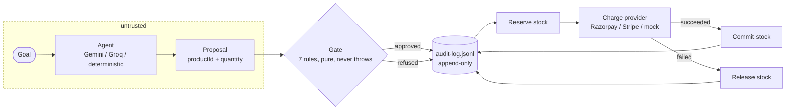

# Architecture

## The one idea

An LLM decides *what* to buy. It never decides *whether* the purchase is allowed.

Those are two different questions, and the second one is not a language problem. So the gate is not
a prompt, not a tool description and not a system message the model can argue with. It is a pure
function that runs after the model has spoken and before any money moves.



Everything to the left of the gate is untrusted. Everything to the right has already been checked.

## Trust boundary

The proposal crossing that boundary is exactly two fields:

```json
{ "productId": "prod_001", "quantity": 2 }
```

There is no price field. There is no currency field. There is no total. The agent cannot name a
price because the schema has `additionalProperties: false`, so a model that emits `price: 0` is
rejected before any code reads it. Price comes from the catalog, server-side, always.

This is why `MALFORMED_PROPOSAL` matters more than it looks. It is not input validation for
tidiness. It is the boundary that stops a compromised or confused model from setting its own terms.

## One schema, four consumers

[`src/schemas/order-proposal.schema.json`](src/schemas/order-proposal.schema.json) is 20 lines and
is the keystone of the project. It is read by:

1. **The gate** compiles it with Ajv (draft 2020-12) and validates every proposal against it.
2. **Gemini** receives it as `parametersJsonSchema` on the function declaration.
3. **Groq** receives it as `function.parameters` in the OpenAI-compatible tool call.
4. **MCP** advertises it as `place_order`'s `inputSchema`.

So the shape the model is *told* to produce and the shape the server *enforces* cannot drift apart.
They are the same file. Tightening the pattern on `productId` tightens the model's instructions,
the MCP contract and the server's validation in one edit.

## The gate

[`src/gate.ts`](src/gate.ts) exports one function:

```ts
evaluateOrder(proposal: unknown, context: GateContext): Decision
```

`proposal` is `unknown` on purpose: the signature states that nothing about it is trusted. It is
pure, has no I/O, and never throws. Ordering matters and is deliberate: schema first, because no
field can be trusted until the shape is known; identity and currency next; then the three limits,
cheapest check first.

Every refusal carries a machine-readable `code` and a human-readable `reason`. The code drives the
UI and the MCP error; the reason is what a person reads in the ledger.

## Money never moves before the log

[`src/order.ts`](src/order.ts) sequences one order:

1. **Idempotency** — if this key was seen before, replay the stored outcome. No second charge.
2. **Gate** — evaluate, with spend-to-date folded from the ledger.
3. **Log the decision** — written *before* any charge is attempted.
4. **Reserve** stock, or refuse if another order took it in between.
5. **Charge** the payment provider.
6. **Commit** on success, **release** on failure.
7. **Log the payment.**

Step 3 before step 5 is the invariant that makes the ledger trustworthy. A crash between them leaves
a decision with no payment, which is recoverable and visible. The reverse order would leave money
moved with no record, which is neither.

## State is derived, not stored

There is no database. `data/audit-log.jsonl` is append-only JSONL, and everything else is folded
from it:

- **Spend in the window** — [`spendSince`](src/audit.ts) folds each order's lines into one row
  *before* summing, so a single order that produced both a `decision` and a `payment` line counts
  once. Pending payments count against the budget; failed and blocked ones do not.
- **Stock** — [`restoreFromLedger`](src/settle.ts) replays the ledger at startup: settled sales are
  consumed, pending ones are re-reserved. This is what lets the MCP server and the web server hold
  consistent stock in separate processes.

The rolling window falls out of this for free. Nothing expires anything; `spendSince` simply stops
counting rows older than the window, so budget returns on its own an hour after it was spent.

## Two-phase stock

An order that is approved but not yet paid must not be sellable, and must not be lost if the payment
fails. [`src/inventory.ts`](src/inventory.ts) separates the two:

- `reserve(orderId, ...)` holds stock without decrementing it. `available()` subtracts reservations.
- `commit(orderId)` turns a reservation into a real decrement.
- `release(orderId)` drops it and the stock comes back.

Razorpay payment links settle asynchronously, so an order can sit `pending` for a long time. It
holds both its stock and its budget for as long as it does, and abandoning it returns both.

## Payment providers

[`src/payment/types.ts`](src/payment/types.ts) defines a four-method interface: `name`, `charge`,
and optional `poll` and `cancel`. `resolvePaymentClient()` picks the first available:

**Razorpay** (test mode) → **Stripe** (test mode) → **mock**

Razorpay is the primary integration and creates real test-mode payment links with a `callback_url`
back to `GET /return`, which settles the order and redirects. Stripe is kept as a second
implementation to prove the abstraction is real rather than a single provider wearing an interface.
The mock is what makes `npm run demo:gate` work on a laptop with no keys and no network.

A declined card is not terminal for a payment link: Razorpay leaves it open for another attempt. So
cancellation is the only way to make failure final, which is what the Abandon button does.

## Agent chain

`resolveAgent()` composes whatever keys are present into a fallback chain:

**Gemini** (`gemini-3.1-flash-lite`) → **Groq** (`openai/gpt-oss-120b`) → **deterministic keyword matcher**

`withFallback` catches a failure from the primary and tries the next, reporting which one actually
decided. This is why a Gemini rate limit degrades the demo instead of ending it, and why the store
still runs with no keys at all.

The system prompt deliberately does **not** mention the budget, the caps or the stock rules. The
model is not asked to police itself. Anything it does not know, it cannot leak, be argued out of, or
forget under a long context.

## Interfaces

The same core is reachable three ways, and all three go through `placeOrder`:

| Surface | Entry | For |
| --- | --- | --- |
| HTTP + React | [`src/server.ts`](src/server.ts) | People, and the demo |
| MCP (stdio) | [`src/mcp-server.ts`](src/mcp-server.ts) | Any AI assistant |
| Node scripts | `src/demo-*.ts` | Showing the rules without a browser |

`POST /api/orders` and `POST /api/agent` return **422** with the full decision when the gate refuses.
A refusal is a valid, well-formed answer, not a server error, and the frontend renders it as a
first-class outcome.

## Trade-offs

- **JSONL, not a database.** The ledger is the source of truth and stays readable with `cat`. It is
  single-process-writer and would not survive horizontal scaling, which is the right trade for a
  system whose main claim is auditability.
- **In-memory inventory, rebuilt from the ledger.** Correct across restarts and across processes,
  but it replays the whole ledger at startup.
- **Caps are constants** in `defaultGateConfig`, not per-user policy. Per-agent budgets are the
  obvious next step, and `GateContext` already takes a config so nothing structural is in the way.
- **No authentication.** Every caller is the same customer. Real deployment needs identity before
  per-agent limits mean anything.
